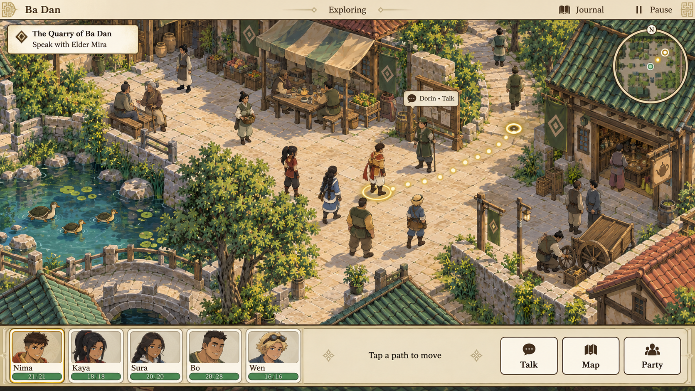
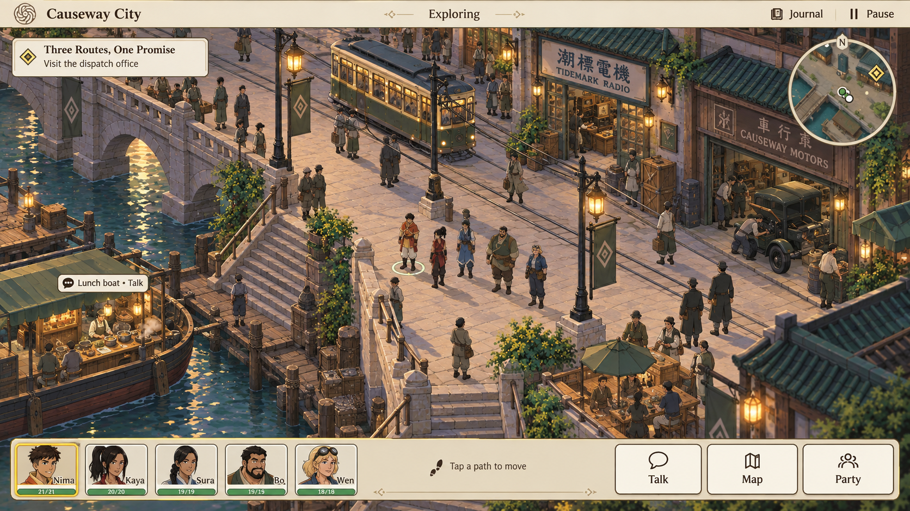
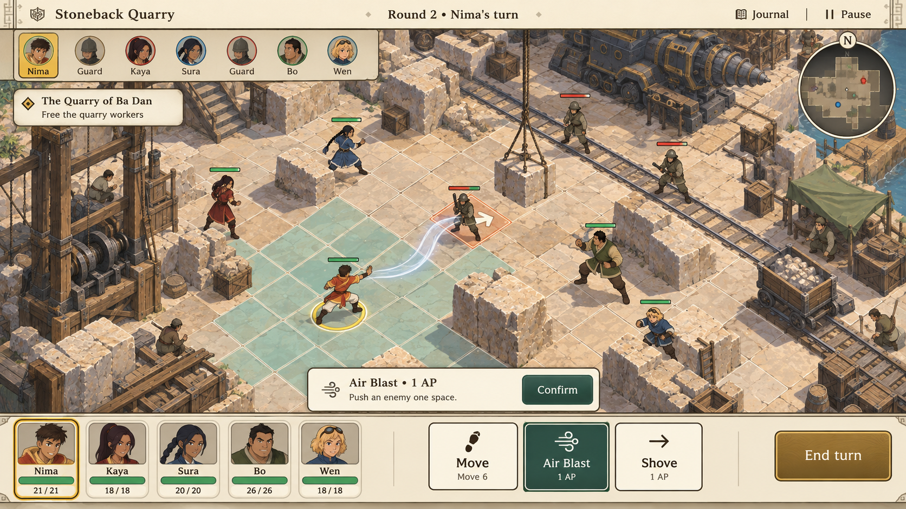

# Approved player-view target

Jared approved these three player-view concepts on 17 September 2026 as the
long-term destination for Four Nations Tactics. Use them together when reviewing
camera, interface, environment, character integration and combat readability.
They are design references, not screenshots of implemented gameplay.

## What the approval means

- An elevated player camera shows a navigable neighborhood or tactical encounter.
  Characters have adult proportions and remain small enough to read the space
  around them. Match ground contact, scale, light, occlusion and painted detail.
- The world occupies most of the screen. A restrained parchment-and-ink header
  identifies the place; a compact bottom dock holds portraits, real health and
  useful touch actions. Type and touch targets remain accessible at Large text.
- Exploration has continuous paths, optional discoveries, readable exits,
  conversation opportunities, familiar animals and people worth revisiting.
  A visibly open path must agree with the actual collision and pathfinding data.
- A local map, objective cues and a way to return the camera to the party help
  orientation. These must be generated from real world state, not painted into
  a backdrop or maintained as a second version of the map.
- Turn-based combat adds a compact initiative strip, clear movement and target
  previews, ability costs and confirmation. Show one acting unit's decision.
  Every prediction comes from the real rules. Grid readability remains subject
  to the existing grid and accessibility settings.
- Bending has physical direction and distinct materials: air through pressure
  and displaced surroundings; water from an available source; heavy earth;
  deliberate fire strikes. Preserve animation, hit and sound timing.
- Rural places retain local traditions. Urban areas belong to the post-Korra
  era, with electric lighting, rail, radios, workshops and appropriate vehicles.
  Causeway is an original regional city; Republic City is a separate place.
  The four nations and spirits remain part of the wider world before Seven
  Havens. The exact year remains reserved.

## What the pictures do not decide

Health values, ability descriptions, map geometry, portrait variants, incidental
lettering and character details generated in these pictures are not gameplay or
story facts. In particular, the inconsistent facial hair on Bo is not an approved
redesign. Keep the established character identities and canonical reference
sheets. A visible map button does not establish fast travel or teleportation.

The current renderer uses an axis-aligned logical grid and calibrated paintings.
The references use an oblique view. Do not rotate or skew a finished backdrop
under unchanged pointer picking, unit placement or collision data. A projection
change needs its own implementation ADR, shared forward/inverse transforms and
both-backend hit-testing coverage. This approval does not select a new engine.

## Exploration, animation and story direction

Jared's added direction on 19 September is to keep the game fun and make a
beautiful world that players want to explore. Spiritfarer and Supergiant are
references for a consistent, expressive approach to art, animation and dialogue.
Prefer a small, coherent set of well-timed poses and transitions that belongs
to the characters over adding animation volume without improving their presence.
Judge walking, stopping, interacting and fighting together in actual play.

Divinity: Original Sin 2 informs the desire for surprising, understandable
combat combinations. Divinity, Baldur's Gate, Hollow Knight and Fallout inform
the desire for an intriguing world, discoveries and characters who move the
story forward. Dead Cells and Hyper Light Drifter inform the desire for
environments that sustain interest with little dialogue. These are the user's
creative references; preserve this game's original people, situations and art.

Free movement and optional routes must reward curiosity. A visible landmark,
side path, working resident or changed place should offer a reason to look
closer. Let environment, action and consequences carry story alongside concise,
distinctive dialogue. Story progression should give the player a reason to
continue while leaving room to wander and revisit. Apply this first within
the existing village–forest–quarry–return slice before expanding destinations.

Review the slice by asking what drew the player off the main route, what they
learned through the world, what changed after their choices, which character
made them curious, and which tactical combination was enjoyable to discover.
Passing functional checks alone does not answer these questions.

## Delivery sequence

| Milestone                         | Playable result                                                                                           | Acceptance evidence                                                                                              |
| --------------------------------- | --------------------------------------------------------------------------------------------------------- | ---------------------------------------------------------------------------------------------------------------- |
| 1. Exploration presentation       | Full-width map, compact party dock, reachable controls and camera recentering                             | Surface and iPad-sized gallery views, largest-text and portrait checks, real taps still reach the painted tiles  |
| 2. Navigation and map composition | Real local map and objective cues; scenery, paths and obstacles use matching geometry                     | Walk every apparent path in a bounded Ba Dan slice; inspect gates, occlusion and touch picking on both renderers |
| 3. One complete village slice     | Consistent characters walk, stop, talk, explore and enter a nearby encounter in the approved art language | A continuous playthrough from Ba Dan through the road and back, including saving and reloading                   |
| 4. Tactical presentation          | Battle framing, targeting, elemental motion and UI match the same visual system                           | Real move/attack previews, cover, larger units, reduced motion, both renderers and touch devices                 |
| 5. Connected regional world       | Authored routes, discoveries, recurring residents and consequences through the first region               | Revisit places after choices; validate world connections, progression and saves                                  |
| 6. Wider destinations             | Distinct city, marsh, industrial and mountain spaces, then meaningful journeys beyond the Reach           | A validated playable slice per destination, with era, lore, art and performance review                           |

Finish and compare one playable slice before multiplying locations. Preserve the
ongoing directional-animation and connected-world work; do not replace it with
a separate prototype. The source illustrations live outside `public/` so they
are not downloaded or precached by the game.

## First implementation

The first presentation change moves the existing exploration roster into a
horizontal bottom dock and removes combat AP pips from exploration cards.
Health, player identity and the inspector remain available. The map uses the
full width, and Follow party recenters on the currently drawn walking leader.
Riverside keeps its specialized controls and its existing Follow party action.
Projection, art, combat rules, progression and saves remain separate milestones.

Required checks and automatic merge policy remain those in `AGENTS.md` and
`CLAUDE.md`. A generated picture is never evidence that its gameplay exists.
